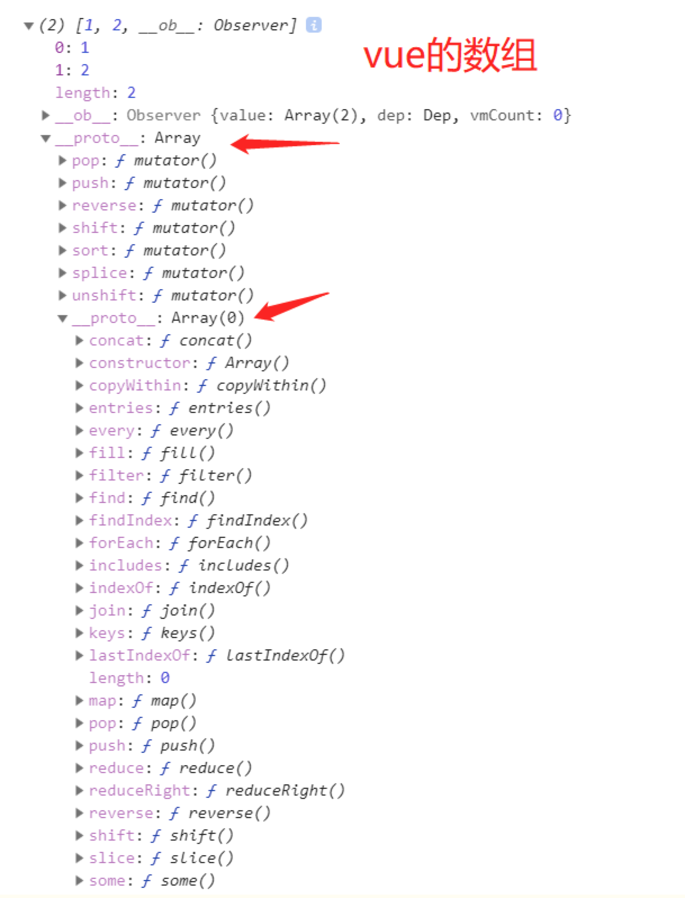
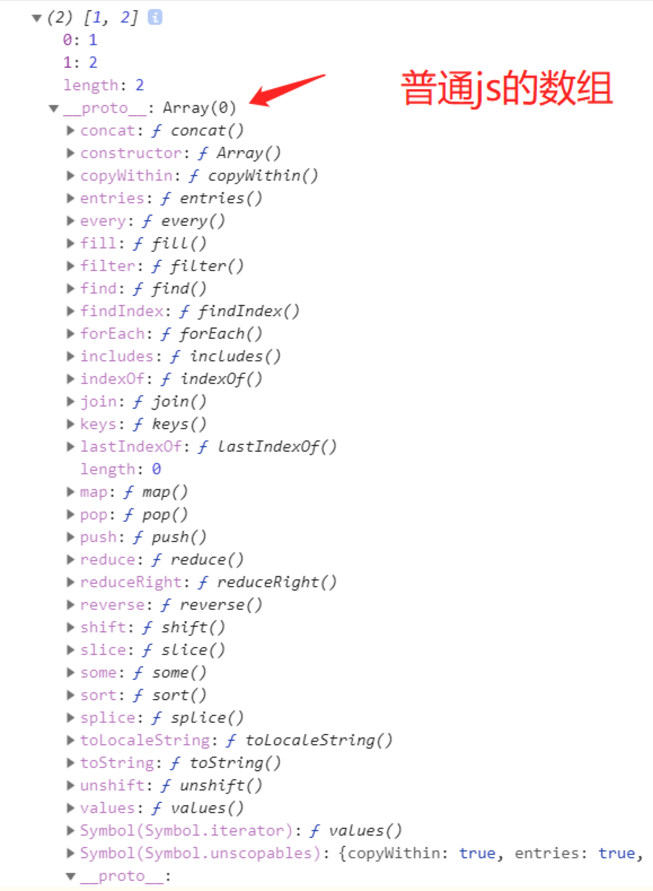

name: 从vue源码看Vue.set()和this.$set()
tag: vue, 源码
description: vue源码系列


# 从vue源码看Vue.set/this.$set()

## 前言
vue2.0提供了`Vue.set()`的方法，那么我们应该先问为什么会加一个这样的方法，再问这个方法到底是干什么的。


### Vue.set()和this.$set()应用的场景
看下面的代码

```
const vueInstance = new Vue({
  data: {
    arr: [1, 2],
    obj1: {
        a: 3
    }
  }
});

vueInstance.$data.arr[0] = 3;  // 页面不会重新渲染
vueInstance.$data.obj1.b = 3;  // 页面不会重新渲染
```
vue文档上说：
Vue.set()向响应式对象中添加一个属性，并确保这个新属性同样是响应式的，且触发视图更新。它必须用于向响应式对象上添加新属性，因为 Vue 无法探测普通的新增属性 (比如 this.myObject.newProperty = 'hi')

所以按照官网的写法，我们应该使用下面这种写法：

```
Vue.set(vueInstance.$data.arr, 0, 3);  // 这样操作数组可以让页面重新渲染
vueInstance.$set(vueInstance.$data.arr, 0, 3); // 这样操作数组也可以让页面重新渲染
Vue.set(vueInstance.$data.obj1, b, 3);  // 这样操作对象可以让页面重新渲染
vueInstance.$set(vueInstance.$data.obj1, b, 3); // 这样操作对象也可以让页面重新渲染
```
### Vue2.0新增Vue.set()和this.$set()方法来解决这种问题

查看源码

```
import { set } from '../observer/index'

...
Vue.set = set
...
```
再来看看this.$set()的源码：

```
import { set } from '../observer/index'

...
Vue.prototype.$set = set
...
```
结果我们发现Vue.set()和this.$set()这两个api的实现原理基本一模一样，都是使用了set函数。set函数是从 ../observer/index 文件中导出的。

区别在于Vue.set()是将set函数绑定在Vue构造函数上，this.$set()是将set函数绑定在Vue原型上。

接下来我们根据 ../observer/index 中找出set函数：

```
function set (target: Array<any> | Object, key: any, val: any): any {
  if (process.env.NODE_ENV !== 'production' &&
    (isUndef(target) || isPrimitive(target))
  ) {
    warn(`Cannot set reactive property on undefined, null, or primitive value: ${(target: any)}`)
  }
  if (Array.isArray(target) && isValidArrayIndex(key)) {
    target.length = Math.max(target.length, key)
    target.splice(key, 1, val)
    return val
  }
  if (key in target && !(key in Object.prototype)) {
    target[key] = val
    return val
  }
  const ob = (target: any).__ob__
  if (target._isVue || (ob && ob.vmCount)) {
    process.env.NODE_ENV !== 'production' && warn(
      'Avoid adding reactive properties to a Vue instance or its root $data ' +
      'at runtime - declare it upfront in the data option.'
    )
    return val
  }
  if (!ob) {
    target[key] = val
    return val
  }
  defineReactive(ob.value, key, val)
  ob.dep.notify()
  return val
}
```
我们发现set函数接收三个参数分别为 target、key、val，其中target的值为数组或者对象，这正好和官网给出的调用Vue.set()方法时传入的参数参数对应上。

```
Vue.set(target, key, value)
	
	·参数：
		{Object | Array} target
		{string | number} key
		{any} value
		
	·返回值：设置的值

```
接着往下看：

```
if (process.env.NODE_ENV !== 'production' &&
    (isUndef(target) || isPrimitive(target))
  ) {
    warn(`Cannot set reactive property on undefined, null, or primitive value: ${(target: any)}`)
  }
```

我们先看isUndef和isPrimitive方法，从名字就可以看出，isUndef是判断target是不是等于undefined或者null。isPrimitive是判断target的数据类型是不是string、number、symbol、boolean中的一种。所以这里的意思是如果当前环境不是生产环境并且 isUndef(target) || isPrimitive(target) 为真的时候，那么就抛出错误警告。

再接着往下：

```
if (Array.isArray(target) && isValidArrayIndex(key)) {
    target.length = Math.max(target.length, key)
    target.splice(key, 1, val)
    return val
  }
```

这里实际就是修改数组时调用set方法时让我们能够触发响应的代码，不过在分析这段代码之前我们来看看vue中的数组实际上是长什么样的。下面分别是vue中的数组和普通的js数组：





vue中的数组我们命名为arrVue，js中的普通数组命名为arrJs。其实我们平时调用普通数组的push、pop等方法是调用的Array原型上面定义的方法， 从图中我们可以看出arrJs的原型是指向Array.prototype，也就是说 

```
arrJs.__proto__ == Array.prototype。
```


但是在vue的数组中，我们发现arrVue的原型其实不是指向的Array.prototype，而是指向的一个对象（我们这里给这个对象命名为arrayMethods）。arrayMethods上面只有7个push、pop等方法，并且arrayMethods的原型才是指向的Array.prototype。所以我们在vue中调用数组的push、pop等方法时其实不是直接调用的数组原型给我们提供的push、pop等方法，而是调用的arrayMethods给我们提供的push、pop等方法。vue为什么要给数组的原型链上面加上这个arrayMethods呢？这里涉及到了vue的数据响应的原理，我们这篇文章暂时不谈论数据响应原理的具体实现。这里你可以理解成vue在arrayMethods对象中做过了特殊处理，如果你调用了arrayMethods提供的push、pop等7个方法，那么它会触发当前收集的依赖（这里收集的依赖可以暂时理解成渲染函数），导致页面重新渲染。换句话说，对于数组的操作，我们只有使用arrayMethods提供的那7个方法才会导致页面渲染，这也就解释了为什么我们使用 `vueInstance.$data.arr[0] = 3`;时不会导致页面出现渲染。

搞清楚vue中的数组具体是怎么实现了之后，我们再来看上面的代码：

```
if (Array.isArray(target) && isValidArrayIndex(key)) {
    target.length = Math.max(target.length, key)
    target.splice(key, 1, val)
    return val
  }
```

首先if判断当前target是不是数组，并且key的值是有效的数组索引。然后将target数组的长度设置为target.length和key中的最大值，这里为什么要这样做呢?是因为我们可能会进行下面这种操作：

```
arr1 = [1,3];
Vue.set(arr1,10,1)  // 如果不那样做，这种情况就会出问题
```

接着向下看，我们发现这里直接调用了target.splice(key, 1, val)，在前面我们说过调用arrayMethods提供的push、pop等7个方法可以导致页面重新渲染，刚好splice也是属性arrayMethods提供的7个方法中的一种。

总结一下Vue.set数组实现的原理：其实Vue.set()对于数组的处理其实就是调用了splice方法，是不是发现其实很简单

对象的实现原理
我们接着向下看代码：

```
if (key in target && !(key in Object.prototype)) {
    target[key] = val
    return val
  }
```

这里先判断如果key本来就是对象中的一个属性，并且key不是Object原型上的属性。说明这个key本来就在对象上面已经定义过了的，直接修改值就可以了，可以自动触发响应。

关于对象的依赖收集和触发原理我们本文也不做详细解释，你可以暂时先这样理解。vue是使用的Object.defineProperty给对象做了一层拦截，当触发get的时候就会进行依赖收集（这里收集的依赖还是像数组那样，理解成渲染函数），当触发set的时候就会触发依赖，导致渲染函数执行页面重新渲染。那么第一次是在哪里触发get的呢？其实是在首次加载页面渲染的时候触发的，这里会进行递归将对象的属性都依赖收集，所以我们修改对象已有属性值得时候会导致页面重新渲染。这也刚好解释了我们使用 `vueInstance.$data.obj1.b = 3`; 的时候为什么页面不会重新渲染，因为这里的属性b不是对象的已有属性，也就是说属性b没有进行过依赖收集，所以才会导致修改属性b的值页面不会重新渲染。

我们接着向下看代码：

```
const ob = (target: any).__ob__
  if (target._isVue || (ob && ob.vmCount)) {
    process.env.NODE_ENV !== 'production' && warn(
      'Avoid adding reactive properties to a Vue instance or its root $data ' +
      'at runtime - declare it upfront in the data option.'
    )
    return val
  }
  if (!ob) {
    target[key] = val
    return val
  }
```
首先定义变量ob的值为 `target.__ob__`，这个`__ob__`属性到底是什么对象呢？vue给响应式对象都加了一个`__ob__`属性，如果一个对象有这个`__ob__`属性，那么就说明这个对象是响应式对象，我们修改对象已有属性的时候就会触发页面渲染。

`target._isVue || (ob && ob.vmCount)` 的意思是：当前的target对象是vue实例对象或者是根数据对象，那么就会抛出错误警告。

`if (!ob)`为真说明当前的target对象不是响应式对象，那么直接赋值返回即可。

接着向下看：

```
  defineReactive(ob.value, key, val)
  ob.dep.notify()
  return val
```

这里其实才是`vue.set()`真正处理对象的地方。`defineReactive(ob.value, key, val)`的意思是给新加的属性添加依赖，以后再直接修改这个新的属性的时候就会触发页面渲染。

`ob.dep.notify()`这句代码的意思是触发当前的依赖（这里的依赖依然可以理解成渲染函数），所以页面就会进行重新渲染。

#总结
从源码层次看vue提供的vue.set()和this.$set()这两个api还是很简单的，由于本文没有详细解释vue依赖收集和触发，所以有的地方说的还是很模糊。
